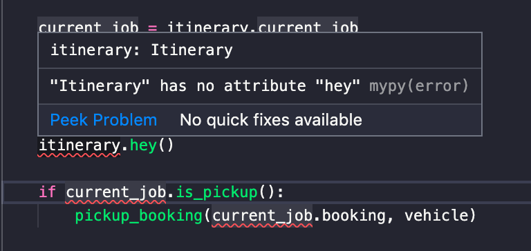
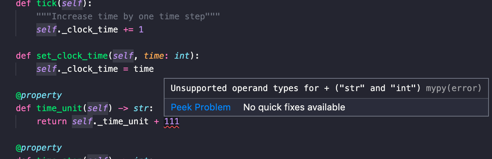

# simobility

simobility - light-weight mobility simulation framework. Best for quick prototyping

Provides simple interface for matching/dispatching/rebalancing:

Pseudocode

```python
booking_1 = Booking(pickup1, dropoff1)
booking_2 = Booking(pickup2, dropoff2)

itinerary = Itinerary(Vehicle())

itinerary.move_to(booking_1.pickup)
itinerary.pickup(booking_1)

itinerary.move_to(booking_2.pickup)
itinerary.pickup(booking_2)

itinerary.move_to(booking_2.dropoff)
itinerary.dropoff(booking_2)

itinerary.move_to(booking_1.dropoff)
itinerary.dropoff(booking_1)

itinerary.move_to(parking)
itinerary.wait(10)
```

### Install 

#### pip

`pip install ...`

#### pipenv

```bash
pipenv install ..
pipenv shell
```

Run sumulation:

`python examples/simulation.py --max-pending-time=3 --search-radius=5 --num-vehicles=10 --duration=1440 --num-bookings=1500 --demand-file='data/rides.feather'`


## Recommendation

Many function parameters, class and instance variables have type annotations and with `mypy` plugging for you IDE, Python will look like a real language:

 




## Read logs

```python
data = pd.read_csv('simulation_log.txt', sep=';', header=None, names=['datetime', 'clock_time', 'object_type', 'uuid', 'itinerary_id', 'from_state', 'to_state', 'details'], parse_dates=['datetime'], converters={'details': lambda v: eval(v)})

details = data.details.apply(pd.Series)
# or

from pandas.io.json import json_normalize
details = json_normalize(data.details)
```
