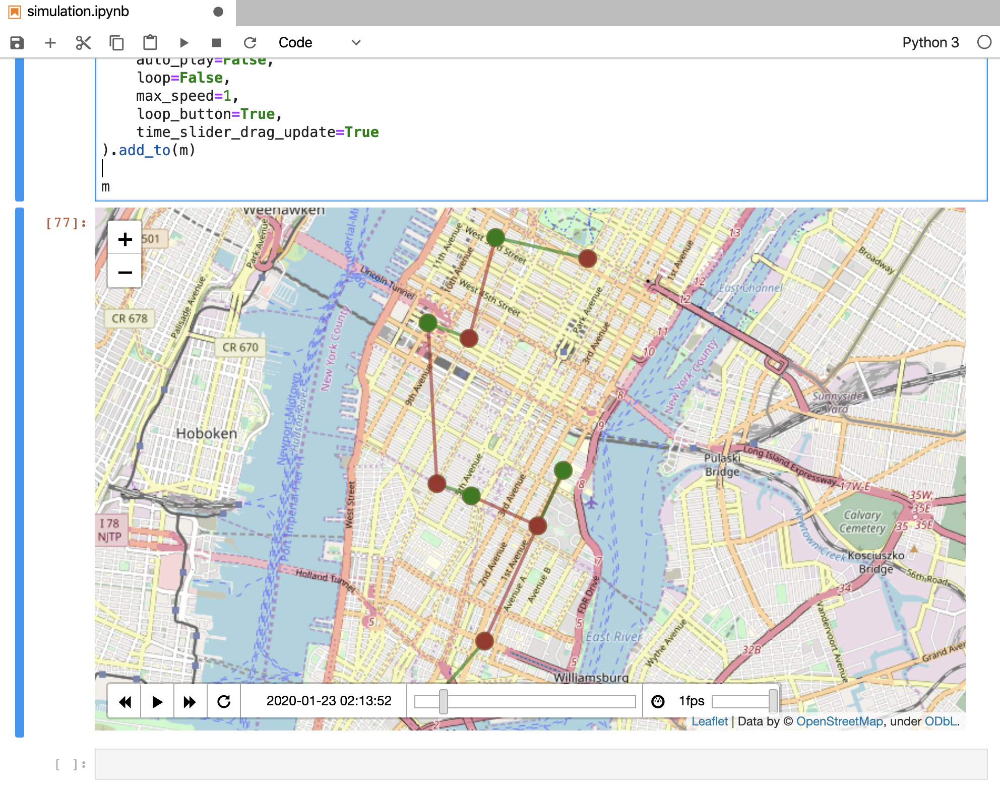

# simobility

**simobility** - light-weight mobility simulation framework. Best for quick prototyping

**simobility** is a human-friendly Python framework that helps scientists and engineers prototype and compare fleet optimization algorithms (autonomous and human-driven vehicles).

Some example of such algorithms:
* [T-Share: A Large-Scale Dynamic Taxi Ridesharing Service](https://www.microsoft.com/en-us/research/publication/t-share-a-large-scale-dynamic-taxi-ridesharing-service/) - one of the classical ridesharing algorithms 
* [MOVI: A Model-Free Approach to Dynamic Fleet Management](https://arxiv.org/abs/1804.04758) - Deep Q-network that directly learns the optimal vehicle dispatch policy
* [Autonomous Vehicle Fleet Sizes Required to Serve Different Levels of Demand](https://www.research-collection.ethz.ch/handle/20.500.11850/104743) - fleet sizing problem
* [On-demand high-capacity ride-sharing via dynamic trip-vehicle assignment](https://www.pnas.org/content/114/3/462)

## Framework

**simobility** provides a set of building blocks for designing simulations:
- clock
- dispatcher
- demand model
- vehicles
- routers
- ...

## Simulation logs

Simulator logs detailed information about each state change. For example:

```bash
clock_time;object_type;uuid;itinerary_id;from_state;to_state;lon;lat;details
0;vehicle;0;;offline;idling;-73.99715;40.71196;{}
0;vehicle;1;;offline;idling;-73.98232;40.76953;{}
0;vehicle;2;;offline;idling;-73.98243;40.785;{}
0;vehicle;3;;offline;idling;-74.00742;40.72601;{}
...
11;booking;1;;created;pending;-73.97634;40.75146;{"dropoff":{"lat":40.76076,"lon":-73.99792}}
11;booking;2;;created;pending;-73.98123;40.78109;{"dropoff":{"lat":40.80811,"lon":-73.9665}}
...
23;vehicle;29;00e6fa3da6044dc09d0ee85eb81ce703;idling;moving_to;-73.97634;40.75146;{"dropoff":1,"dst":{"lat":40.76076,"lon":-73.99792},"route_duration":38,"route_distance":2.091,"trip_duration":0,"trip_distance":0.0}
23;booking;1;00e6fa3da6044dc09d0ee85eb81ce703;pickup;waiting_dropoff;-73.97634;40.75146;{"vid":29}
26;booking;3;;created;pending;-73.94856;40.78247;{"dropoff":{"lat":40.72625,"lon":-73.98937}}
26;vehicle;14;50f1382193a749d2a46f240f6bb75abd;idling;moving_to;-73.95228;40.77206;{"eta":22,"pickup":3,"dst":{"lat":40.78247,"lon":-73.94856},"route_duration":22,"route_distance":1.199,"trip_duration":0,"trip_distance":0.0}
26;booking;3;50f1382193a749d2a46f240f6bb75abd;pending;matched;-73.94856;40.78247;{"vid":14}
26;booking;3;50f1382193a749d2a46f240f6bb75abd;matched;waiting_pickup;-73.94856;40.78247;{"vid":14}
```

As a result, each step of a simulation can be visualized and various metrics can be calculated. For example:

```json
{
    "avg_paid_utilization": 63.98,
    "avg_utilization": 96.87,
    "avg_waiting_time": 292.92,
    "created": 3998,
    "dropoffs": 589,
    "empty_distance": 640.37,
    "empty_distance_pcnt": 33.67,
    "fleet_paid_utilization": 63.98,
    "fleet_utilization": 96.87,
    "num_vehicles": 50,
    "pickup_rate": 15.48,
    "pickups": 619,
    "total_distance": 1902.04,
}
```

Animated visualization in Jupyter notebook with [folium](https://github.com/python-visualization/folium)



## Pseudocode:

```python
dispatcher = Dispatcher()

# Fleet model
fleet = Fleet()
taxi_1 = Vehicle()
taxi_2 = Vehicle()
fleet.infleet([taxi_1, taxi_2])

# Demand model
customer_1 = Booking(pickup1, dropoff1)
customer_2 = Booking(pickup2, dropoff2)

# Spatial model
router = Router()
distance_matrix = router.calculate_distance_marix(
    [customer_1, customer_2],
    [taxi_1, taxi_2]
)

#
# ... Find best match between customers and taxies ...
# Prototype and compare different supply-demand matching algorithms
#

# Create a ride sharing order for taxi_1
itinerary = Itinerary(taxi_1)

# Pickup customer #1
itinerary.move_to(customer_1.pickup)
itinerary.pickup(customer_1)

# Pickup customer #2
itinerary.move_to(customer_2.pickup)
itinerary.pickup(customer_2)

# Dropoff customer #2
itinerary.move_to(customer_2.dropoff)
itinerary.dropoff(customer_2)

# Dropoff customer #1
itinerary.move_to(customer_1.dropoff)
itinerary.dropoff(customer_1)

# Go to parking and wait there
itinerary.move_to(parking)
itinerary.wait(10)

# Dispatch taxies
dispatcher.dispatch(itinerary)

# Analyze logs, calculate metrics/KPIs, create visualizations...
```

## Read simulation output

```python
columns = [
    "datetime",
    "clock_time",
    "object_type",
    "uuid",
    "itinerary_id",
    "from_state",
    "to_state",
    "details",
]

data = pd.read_csv(
    "simulation_output.csv",
    sep=";",
    header=None,
    names=columns,
    parse_dates=["datetime"],
    converters={"details": lambda v: eval(v)},
)

details = data.details.apply(pd.Series)
# or

from pandas.io.json import json_normalize
details = json_normalize(data.details)
```

## Run OSRM

```bash
wget http://download.geofabrik.de/north-america/us/new-york-latest.osm.pbf
docker run -t -v "${PWD}:/data" osrm/osrm-backend osrm-extract -p /opt/car.lua /data/new-york-latest.osm.pbf
docker run -t -v "${PWD}:/data" osrm/osrm-backend osrm-partition /data/new-york-latest.osrm
docker run -t -v "${PWD}:/data" osrm/osrm-backend osrm-customize /data/new-york-latest.osrm
docker run -d -t -i -p 5010:5000 -v "${PWD}:/data" osrm/osrm-backend osrm-routed --algorithm mld /data/new-york-latest.osrm
```
